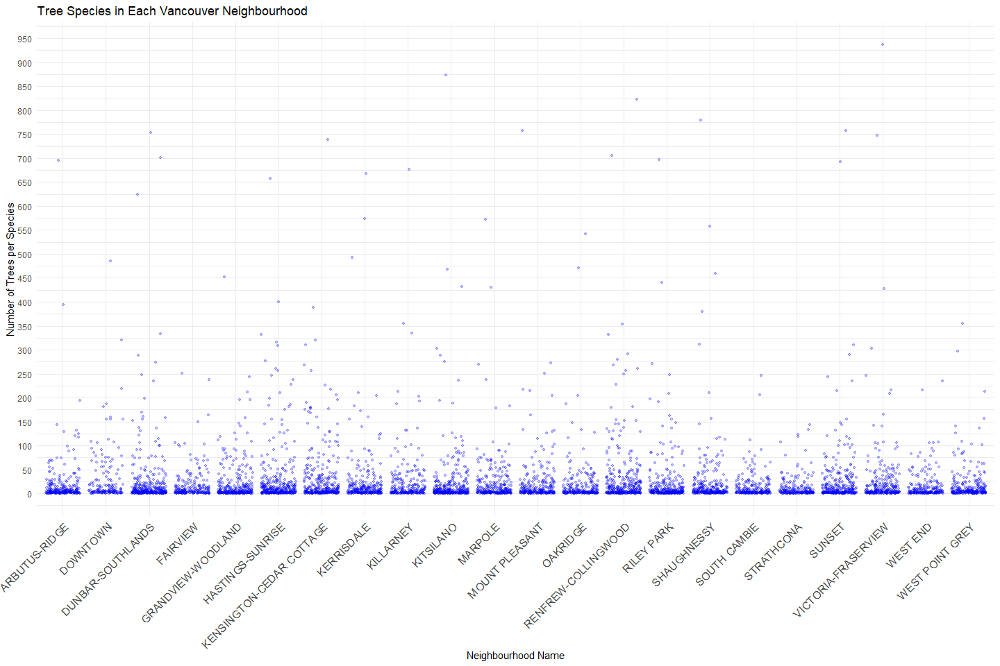
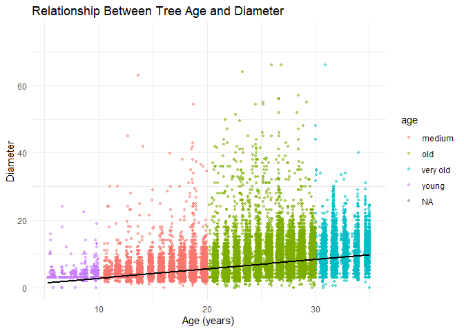
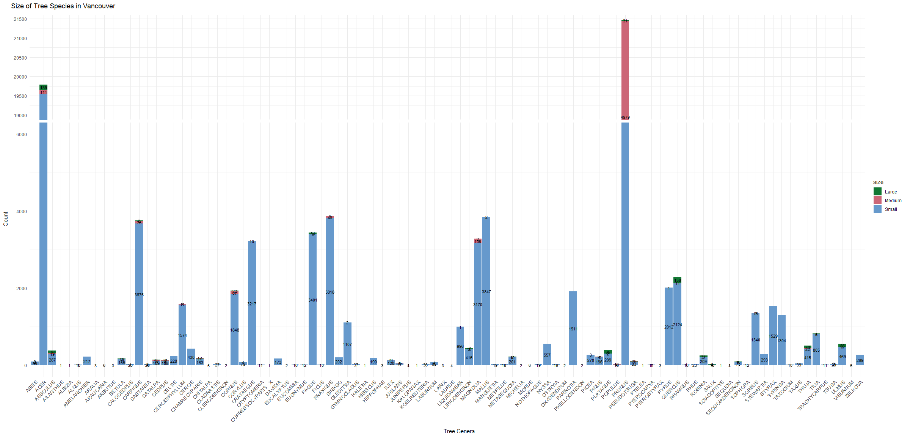
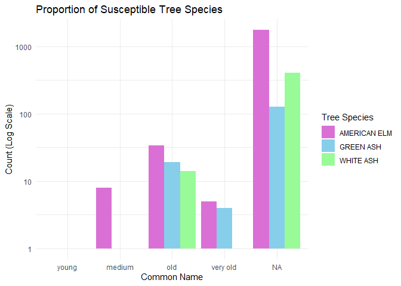

Mini Data Analysis Milestone 2
================

# Welcome to the Rest of your Mini Data Analysis Project!

In Milestone 1, you explored your data. and came up with research
questions. This time, we will finish up our mini data analysis and
obtain results for your data by:

- Making summary tables and graphs
- Manipulating special data types in R: factors and/or dates and times.
- Fitting a model object to your data, and extract a result.
- Reading and writing data as separate files.

We will also explore more in depth the concept of *tidy data.*

**NOTE**: The main purpose of the mini data analysis is to integrate
what you learn in class in an analysis. Although each milestone provides
a framework for you to conduct your analysis, it’s possible that you
might find the instructions too rigid for your data set. If this is the
case, you may deviate from the instructions – just make sure you’re
demonstrating a wide range of tools and techniques taught in this class.

# Instructions

**To complete this milestone**, edit [this very `.Rmd`
file](https://raw.githubusercontent.com/UBC-STAT/stat545.stat.ubc.ca/master/content/mini-project/mini-project-2.Rmd)
directly. Fill in the sections that are tagged with
`<!--- start your work here--->`.

**To submit this milestone**, make sure to knit this `.Rmd` file to an
`.md` file by changing the YAML output settings from
`output: html_document` to `output: github_document`. Commit and push
all of your work to your mini-analysis GitHub repository, and tag a
release on GitHub. Then, submit a link to your tagged release on canvas.

**Points**: This milestone is worth 50 points: 45 for your analysis, and
5 for overall reproducibility, cleanliness, and coherence of the Github
submission.

**Research Questions**: In Milestone 1, you chose four research
questions to focus on. Wherever realistic, your work in this milestone
should relate to these research questions whenever we ask for
justification behind your work. In the case that some tasks in this
milestone don’t align well with one of your research questions, feel
free to discuss your results in the context of a different research
question.

# Learning Objectives

By the end of this milestone, you should:

- Understand what *tidy* data is, and how to create it using `tidyr`.
- Generate a reproducible and clear report using R Markdown.
- Manipulating special data types in R: factors and/or dates and times.
- Fitting a model object to your data, and extract a result.
- Reading and writing data as separate files.

# Setup

Begin by loading your data and the tidyverse package below:

``` r
library(datateachr) # <- might contain the data you picked!
library(tidyverse)
library(ggbreak)
```

# Task 1: Process and summarize your data

From milestone 1, you should have an idea of the basic structure of your
dataset (e.g. number of rows and columns, class types, etc.). Here, we
will start investigating your data more in-depth using various data
manipulation functions.

### 1.1 (1 point)

First, write out the 4 research questions you defined in milestone 1
were. This will guide your work through milestone 2:

<!-------------------------- Start your work below ---------------------------->

1.  How does tree species diversity vary across different neighbourhoods
    of Vancouver?

2.  Is there a relationship between the age of the trees and how wide
    their diameter is?

3.  Is there a correlation between the species of tree and how big it
    is, in terms of height and diameter?

4.  Since this data started to be collected, have trends of planting
    trees susceptible to invasive species (American Elm, Green Ash, and
    White Ash) declined?

    <!----------------------------------------------------------------------------->

Here, we will investigate your data using various data manipulation and
graphing functions.

### 1.2 (8 points)

Now, for each of your four research questions, choose one task from
options 1-4 (summarizing), and one other task from 4-8 (graphing). You
should have 2 tasks done for each research question (8 total). Make sure
it makes sense to do them! (e.g. don’t use a numerical variables for a
task that needs a categorical variable.). Comment on why each task helps
(or doesn’t!) answer the corresponding research question.

Ensure that the output of each operation is printed!

Also make sure that you’re using dplyr and ggplot2 rather than base R.
Outside of this project, you may find that you prefer using base R
functions for certain tasks, and that’s just fine! But part of this
project is for you to practice the tools we learned in class, which is
dplyr and ggplot2.

**Summarizing:**

1.  Compute the *range*, *mean*, and *two other summary statistics* of
    **one numerical variable** across the groups of **one categorical
    variable** from your data.
2.  Compute the number of observations for at least one of your
    categorical variables. Do not use the function `table()`!
3.  Create a categorical variable with 3 or more groups from an existing
    numerical variable. You can use this new variable in the other
    tasks! *An example: age in years into “child, teen, adult, senior”.*
4.  Compute the proportion and counts in each category of one
    categorical variable across the groups of another categorical
    variable from your data. Do not use the function `table()`!

**Graphing:**

5.  Create a graph of your choosing, make one of the axes logarithmic,
    and format the axes labels so that they are “pretty” or easier to
    read.
6.  Make a graph where it makes sense to customize the alpha
    transparency.

Using variables and/or tables you made in one of the “Summarizing”
tasks:

7.  Create a graph that has at least two geom layers.
8.  Create 3 histograms, with each histogram having different sized
    bins. Pick the “best” one and explain why it is the best.

Make sure it’s clear what research question you are doing each operation
for!

<!------------------------- Start your work below ----------------------------->

### Question 1: How does tree species diversity vary across different neighbourhoods of Vancouver?

#### 4. Compute the proportion and counts in each category of one categorical variable across the groups of another categorical variable from your data.

``` r
tree_species_count <- vancouver_trees %>%
  group_by(neighbourhood_name, common_name) %>%
  summarize(n = n(), .groups = 'drop') %>%
  group_by(neighbourhood_name) %>%
  mutate(proportion = n/sum(n))

print(tree_species_count)
```

    ## # A tibble: 6,141 × 4
    ## # Groups:   neighbourhood_name [22]
    ##    neighbourhood_name common_name                  n proportion
    ##    <chr>              <chr>                    <int>      <dbl>
    ##  1 ARBUTUS-RIDGE      ACCOLADE CHERRY              1   0.000193
    ##  2 ARBUTUS-RIDGE      AKEBONO FLOWERING CHERRY    61   0.0118  
    ##  3 ARBUTUS-RIDGE      ALDERLEAFED MOUNTAIN ASH     8   0.00155 
    ##  4 ARBUTUS-RIDGE      ALIA'S MAGNOLIA              3   0.000580
    ##  5 ARBUTUS-RIDGE      AMERICAN ELM                92   0.0178  
    ##  6 ARBUTUS-RIDGE      AMERICAN FILBERT             4   0.000774
    ##  7 ARBUTUS-RIDGE      AMERICAN HORNBEAM           14   0.00271 
    ##  8 ARBUTUS-RIDGE      AMERICAN MOUNTAIN ASH        8   0.00155 
    ##  9 ARBUTUS-RIDGE      AMERICAN SWEETGUM            2   0.000387
    ## 10 ARBUTUS-RIDGE      AMUR MAPLE                   5   0.000967
    ## # ℹ 6,131 more rows

By using the group_by function, I was able to organize the
vancouver_trees dataset by the different neighbourhoods, and then
further sort the data into each species of tree, using their common
names. I then used the summarize function to show the number of trees of
each species present in each neighbourhood in the dataset. Then using
the mutate function, I was able to find the proportion of each species
of tree in each neighbourhood. The proportions for each of the tree
species are low, which indicates that the neighbourhoods in vancouver
have a high amount of tree species diversity.

#### 6. Make a graph where it makes sense to customize the alpha transparency.

``` r
ggplot(tree_species_count, aes(x = neighbourhood_name, y = n)) +
  geom_jitter(alpha = 0.25, size = 1, color = "blue") +
  scale_y_continuous(breaks = seq(0, 1000, by = 50)) + 
  labs(title = "Tree Species in Each Vancouver Neighbourhood", x = "Neighbourhood Name", y = "Number of Trees per Species") +
  theme_minimal()+
  theme(axis.text.x = element_text(angle = 45, hjust = 1, size = 12))
```

<!-- -->

This jitter plot shows the number of trees of each species that are in
each neighbourhood in the vancouver_trees dataset. The number of trees
of each species was found in the first question, and stored as
tree_species_count. The alpha transparency in this jitter plot shows
that most of the tree species in each neighbourhood have less than 50
individual trees, as indicated by the darker blue color, and very few
neighbourhoods have tree species with more than 300 individual trees, as
indicated by the light blue points. This plot helps answer the research
question, how does tree species diversity vary across Vancouver’s
neighbourhoods, because the plot shows that the different neighbourhoods
have similar numbers of individual trees per species, between 0 and 50,
indicating that there is a high amount of species diversity in the
neighborhoods.

### Question 2: Is there a relationship between the age of the trees and how wide their diameter is?

#### 3. Create a categorical variable with 3 or more groups from an existing numerical variable. You can use this new variable in the other tasks!

``` r
vancouver_trees_age <- vancouver_trees %>%
  mutate(years_old = as.numeric(difftime(Sys.Date(), date_planted, units = "days")) / 365,
  age = case_when(
    years_old < 10 ~ "young",
    years_old >= 10 & years_old < 20 ~ "medium", 
    years_old >= 20 & years_old < 30 ~ "old", 
    years_old >= 30 ~ "very old"
  ))
print(vancouver_trees_age)
```

    ## # A tibble: 146,611 × 22
    ##    tree_id civic_number std_street    genus_name species_name cultivar_name  
    ##      <dbl>        <dbl> <chr>         <chr>      <chr>        <chr>          
    ##  1  149556          494 W 58TH AV     ULMUS      AMERICANA    BRANDON        
    ##  2  149563          450 W 58TH AV     ZELKOVA    SERRATA      <NA>           
    ##  3  149579         4994 WINDSOR ST    STYRAX     JAPONICA     <NA>           
    ##  4  149590          858 E 39TH AV     FRAXINUS   AMERICANA    AUTUMN APPLAUSE
    ##  5  149604         5032 WINDSOR ST    ACER       CAMPESTRE    <NA>           
    ##  6  149616          585 W 61ST AV     PYRUS      CALLERYANA   CHANTICLEER    
    ##  7  149617         4909 SHERBROOKE ST ACER       PLATANOIDES  COLUMNARE      
    ##  8  149618         4925 SHERBROOKE ST ACER       PLATANOIDES  COLUMNARE      
    ##  9  149619         4969 SHERBROOKE ST ACER       PLATANOIDES  COLUMNARE      
    ## 10  149625          720 E 39TH AV     FRAXINUS   AMERICANA    AUTUMN APPLAUSE
    ## # ℹ 146,601 more rows
    ## # ℹ 16 more variables: common_name <chr>, assigned <chr>, root_barrier <chr>,
    ## #   plant_area <chr>, on_street_block <dbl>, on_street <chr>,
    ## #   neighbourhood_name <chr>, street_side_name <chr>, height_range_id <dbl>,
    ## #   diameter <dbl>, curb <chr>, date_planted <date>, longitude <dbl>,
    ## #   latitude <dbl>, years_old <dbl>, age <chr>

``` r
age_counts <- vancouver_trees_age %>%
  count(age)

print(age_counts)
```

    ## # A tibble: 5 × 2
    ##   age          n
    ##   <chr>    <int>
    ## 1 medium   27145
    ## 2 old      29716
    ## 3 very old  7020
    ## 4 young     6182
    ## 5 <NA>     76548

The new categorical variable, age, has four groups and was created based
on when the trees were planted. The age of trees is stored as a new
variable, years_old, and was calculated as the number of years from
today’s date to when the trees were planted. The four groups in the new
age category are young, which is less than 10 years old, medium, which
is between 10 and 20 years old, old, which is between 20 and 30 years
old, and very old, which is trees older than 30 years old. To see the
number of trees that fall into each category I used the count function
which shows that majority of the trees did not have a data planted
recorded, but of the trees that do have a known age, most of the trees
are medium or old in age, with young trees being the smallest group.
This will help answer the research question because the age variable
tells how old the trees are based on when they were planted, which can
be used to determine if older trees have a larger diameter.

#### 7. Create a graph that has at least two geom layers.

``` r
ggplot(vancouver_trees_age, aes(x = years_old, y = diameter, color = age)) +
  geom_point(alpha = 0.5, size = 1) +
  scale_y_continuous(limits = c(0, 75)) + 
  theme_minimal() +
  geom_smooth(method = "lm", color = "black") +
  labs(title = "Relationship Between Tree Age and Diameter", x = "Age (years)", y = "Diameter")
```

    ## `geom_smooth()` using formula = 'y ~ x'

    ## Warning: Removed 76559 rows containing non-finite outside the scale range
    ## (`stat_smooth()`).

    ## Warning: Removed 76559 rows containing missing values or values outside the scale range
    ## (`geom_point()`).

<!-- -->

This graph shows the relationship between how old the trees in the
vancouver_trees dataset are and how wide their diameter is. The units
used to measure diameter are unknown, and were not provided in the
dataset. From the line of best fit shown in black, we can see that there
is a trend of increasing diameter size with an increase in age of the
trees. This graph helps answer the research question, is there a
relationship between tree age and diameter size, because it shows that
there is a positive correlation between age of the trees and their
diameter size, as the old and very old trees have larger diameters and
the young trees have smaller diameters. 10 trees were removed from this
dataset to make the graph easier to read, as there were 10 trees with
diameters above 100, which caused the line of best fit to be not
visible.

### Question 3: Is there a correlation between the species of tree and how big it is, in terms of height and diameter?

#### 3. Create a categorical variable with 3 or more groups from an existing numerical variable. You can use this new variable in the other tasks

``` r
vancouver_trees_size <- vancouver_trees %>%
  mutate(size = case_when(
    height_range_id < 3 & diameter < 20 ~ "Small",
    height_range_id >= 3 & height_range_id < 4 & diameter >= 20 & diameter < 40 ~ "Medium", 
    height_range_id >= 4 & diameter >= 40 ~ "Large"
  ))

vancouver_trees_size %>%
group_by(size) %>%
  summarize(n = n())
```

    ## # A tibble: 4 × 2
    ##   size       n
    ##   <chr>  <int>
    ## 1 Large    913
    ## 2 Medium  5641
    ## 3 Small  80615
    ## 4 <NA>   59442

``` r
print(vancouver_trees_size)
```

    ## # A tibble: 146,611 × 21
    ##    tree_id civic_number std_street    genus_name species_name cultivar_name  
    ##      <dbl>        <dbl> <chr>         <chr>      <chr>        <chr>          
    ##  1  149556          494 W 58TH AV     ULMUS      AMERICANA    BRANDON        
    ##  2  149563          450 W 58TH AV     ZELKOVA    SERRATA      <NA>           
    ##  3  149579         4994 WINDSOR ST    STYRAX     JAPONICA     <NA>           
    ##  4  149590          858 E 39TH AV     FRAXINUS   AMERICANA    AUTUMN APPLAUSE
    ##  5  149604         5032 WINDSOR ST    ACER       CAMPESTRE    <NA>           
    ##  6  149616          585 W 61ST AV     PYRUS      CALLERYANA   CHANTICLEER    
    ##  7  149617         4909 SHERBROOKE ST ACER       PLATANOIDES  COLUMNARE      
    ##  8  149618         4925 SHERBROOKE ST ACER       PLATANOIDES  COLUMNARE      
    ##  9  149619         4969 SHERBROOKE ST ACER       PLATANOIDES  COLUMNARE      
    ## 10  149625          720 E 39TH AV     FRAXINUS   AMERICANA    AUTUMN APPLAUSE
    ## # ℹ 146,601 more rows
    ## # ℹ 15 more variables: common_name <chr>, assigned <chr>, root_barrier <chr>,
    ## #   plant_area <chr>, on_street_block <dbl>, on_street <chr>,
    ## #   neighbourhood_name <chr>, street_side_name <chr>, height_range_id <dbl>,
    ## #   diameter <dbl>, curb <chr>, date_planted <date>, longitude <dbl>,
    ## #   latitude <dbl>, size <chr>

To answer the research question, is there a correlation between tree
species and size of the tree, determined by height and diameter, I
created a new categorical variable, size, using two numeric variables,
height_range_id and diameter. The size variable has 3 groups, small,
which is trees with a height ID of less than 3 and a diameter of less
than 20, medium, which includes trees with a height range of 3 and 4 and
diameter between 20 and 40, and large trees which includes trees with a
height ID of 4 and 5 and a diameter of larger than 40. The units of
diameter and how tall each of the height range IDs are were not given in
the dataset. I chose to create this dataset with two numeric variables
instead of one so that size, which combines height and diameter, can be
used in the second question to further answer the research question.

#### 7. Create a graph that has at least two geom layers.

``` r
size_data <- vancouver_trees_size %>%
  filter(!is.na(size)) %>%
  group_by(genus_name, size) %>%
  summarize(count=n())
```

    ## `summarise()` has grouped output by 'genus_name'. You can override using the
    ## `.groups` argument.

``` r
print(size_data)
```

    ## # A tibble: 175 × 3
    ## # Groups:   genus_name [96]
    ##    genus_name size   count
    ##    <chr>      <chr>  <int>
    ##  1 ABIES      Large      3
    ##  2 ABIES      Medium     2
    ##  3 ABIES      Small     89
    ##  4 ACER       Large    139
    ##  5 ACER       Medium   111
    ##  6 ACER       Small  19541
    ##  7 AESCULUS   Large     76
    ##  8 AESCULUS   Medium    19
    ##  9 AESCULUS   Small    287
    ## 10 AILANTHUS  Small      1
    ## # ℹ 165 more rows

``` r
ggplot(size_data, aes(x = genus_name, y = count, fill = size)) +
  geom_bar(stat = "identity", position = "stack") +
  geom_text(aes(label = count), position = position_stack(vjust=0.5), size = 3) +
  theme_minimal() +
  scale_y_break(c(6000, 19000)) +
  labs(title = "Size of Tree Species in Vancouver", x = "Tree Genera", y = "Count") +
  scale_fill_manual(values = c("Large" = "#117733",
                               "Medium" = "#CC6677",
                               "Small" = "#6699CC")) +
  theme(axis.text.x = element_text(angle = 45, hjust = 1, size = 10))
```

<!-- -->

To answer the research question, is there a relationship between tree
species and size, I created a stacked bar graph showing the counts of
how many trees are categorized into each size group for each genera of
trees. I had to use genus instead of species for this graph because
there were too many different species of tree to accurately be
represented on the graph, as the different species were too small and
could not be interpreted. I also introduced a break into the y-axis
scale, because two genera of trees, Acer and Prunus, had too many trees
and were causing the other tree genera with fewer individual trees to be
not visible on the graph. From this graph, we can see that less than
half of the genera have trees in the large category. This indicates that
there is a relationship between the type of tree and how big it is.

### Question 4: Since this data started to be collected, have trends of planting trees susceptible to invasive species(American Elm, Green Ash and White Ash) declined?

#### 4. Compute the proportion and counts in each category of one categorical variable across the groups of another categorical variable from your data. Do not use the function `table()`!

``` r
susceptible_trees <- vancouver_trees_age %>%
  filter(common_name == "AMERICAN ELM" |
         common_name == "GREEN ASH" |
         common_name == "WHITE ASH" )

print(susceptible_trees)
```

    ## # A tibble: 2,375 × 22
    ##    tree_id civic_number std_street    genus_name species_name  cultivar_name
    ##      <dbl>        <dbl> <chr>         <chr>      <chr>         <chr>        
    ##  1  156061         2659 W 19TH AV     FRAXINUS   AMERICANA     <NA>         
    ##  2  157229         1846 VENABLES ST   ULMUS      AMERICANA     <NA>         
    ##  3  157612         2188 E 27TH AV     FRAXINUS   PENNSYLVANICA <NA>         
    ##  4  159619         2715 W 38TH AV     ULMUS      AMERICANA     <NA>         
    ##  5  160171         1878 W 60TH AV     FRAXINUS   PENNSYLVANICA <NA>         
    ##  6  161795          449 E 12TH AV     ULMUS      AMERICANA     <NA>         
    ##  7  162516         1060 W 15TH AV     FRAXINUS   AMERICANA     <NA>         
    ##  8  162562         3854 W 14TH AV     ULMUS      AMERICANA     <NA>         
    ##  9  162976         6268 MARGUERITE ST ULMUS      AMERICANA     <NA>         
    ## 10  163533         3525 W 24TH AV     ULMUS      AMERICANA     <NA>         
    ## # ℹ 2,365 more rows
    ## # ℹ 16 more variables: common_name <chr>, assigned <chr>, root_barrier <chr>,
    ## #   plant_area <chr>, on_street_block <dbl>, on_street <chr>,
    ## #   neighbourhood_name <chr>, street_side_name <chr>, height_range_id <dbl>,
    ## #   diameter <dbl>, curb <chr>, date_planted <date>, longitude <dbl>,
    ## #   latitude <dbl>, years_old <dbl>, age <chr>

``` r
species_age <- susceptible_trees %>%
  group_by(common_name, age) %>%
  summarize(count = n()) %>%
  mutate(proportion = count/sum(count))
```

    ## `summarise()` has grouped output by 'common_name'. You can override using the
    ## `.groups` argument.

``` r
print(species_age)
```

    ## # A tibble: 13 × 4
    ## # Groups:   common_name [3]
    ##    common_name  age      count proportion
    ##    <chr>        <chr>    <int>      <dbl>
    ##  1 AMERICAN ELM medium       8   0.00444 
    ##  2 AMERICAN ELM old         34   0.0189  
    ##  3 AMERICAN ELM very old     5   0.00278 
    ##  4 AMERICAN ELM young        1   0.000556
    ##  5 AMERICAN ELM <NA>      1752   0.973   
    ##  6 GREEN ASH    medium       1   0.00667 
    ##  7 GREEN ASH    old         19   0.127   
    ##  8 GREEN ASH    very old     4   0.0267  
    ##  9 GREEN ASH    <NA>       126   0.84    
    ## 10 WHITE ASH    medium       1   0.00235 
    ## 11 WHITE ASH    old         14   0.0329  
    ## 12 WHITE ASH    very old     1   0.00235 
    ## 13 WHITE ASH    <NA>       409   0.962

To answer this research question, I first created a new tibble that
contains only the species of interest, American Elm, Green Ash and White
Ash. American Elm trees are susceptible to Dutch Elm Disease and Ash
trees native to Canada, Green and White Ash, are susceptible to Emerald
Ash Borer. In an effort to reduce the effect of these invasive species
and stop their spread, many cities have stopped planting these trees in
more recent years, which is where my research question comes from. The
count column shows the number of trees per species in each age category.
From this, we can see that most of the trees in each species are in the
old category and none of the species are in the young category, which is
less than 10 years old. The proportions of the number of trees in each
age category per species also shows that most of the trees are in the
old category. These findings support the research question that there
has been a decline in planting susceptible trees, as there are no young
trees and fewer medium aged trees compared to old and very old trees.

#### 5. Create a graph of your choosing, make one of the axes logarithmic, and format the axes labels so that they are “pretty” or easier to read.

``` r
ggplot(species_age, aes(x = factor(age, levels = c("young", "medium", "old", "very old", "NA")), y = count, fill = common_name)) +
  geom_bar(stat = "identity", position = "dodge") +
  scale_y_log10() +
  labs(title = "Proportion of Susceptible Tree Species", 
       x = "Common Name", 
       y = "Count (Log Scale)", 
       fill = "Tree Species") +
  scale_fill_manual(values = c("AMERICAN ELM" = "orchid", 
                               "GREEN ASH" = "skyblue",
                               "WHITE ASH" = "palegreen")) + 
  theme_minimal()
```

<!-- -->

Creating a bar graph with a logarithmic scale for count helps to easily
visualize the number of trees in each age category per species. The
number of trees that did not have an age in the dataset was much higher
than the number of trees in each age category, which made the graph
skewed and the smaller values for the other age categories was hard to
see and interpret. This bar graph helps to answer the research question
because we can easily see that there are more trees in the old and very
old categories, while there are none in the young category. This shows
that in more recent years (the last 20 years), there have been fewer elm
and ash trees that are susceptible to invasive species planted in the
Vancouver.

<!----------------------------------------------------------------------------->

### 1.3 (2 points)

Based on the operations that you’ve completed, how much closer are you
to answering your research questions? Think about what aspects of your
research questions remain unclear. Can your research questions be
refined, now that you’ve investigated your data a bit more? Which
research questions are yielding interesting results?

<!------------------------- Write your answer here ---------------------------->

I believe that from task 1.2, most of my research questions are answered
and I have results that can be interpreted and provide answers for all
of my research questions.

I think question 3 can be refined to investigate the relationship
between the species of tree and size, while taking into account the age
of the trees, as age could be a confounding variable that is affecting
the size of the trees. I also believe that this question could be
further investigated because in task 1.2, I was only able to look at the
relationship between size and the genera of the trees, not the specific
tree species.

I also believe that my first research question can be investigated
further, as I only found how overall diverse the tree species were in
each neighbourhood. The diversity could be further tested by looking
into the relationship between where the trees were planted in each
neighborhood, which can provide another insight into the diversity of
tree species representation in the neighborhoods.

I find the results from my last question most interesting because these
results show that there are less susceptible species being planted. As
more research shows that these trees are too high risk to be planted and
by reducing the amount of these species, spread of invasive species can
be slowed. I would be interested in researching this question further
but the vancouver_trees dataset may not allow this because it does not
contain any information on invasive species.

<!----------------------------------------------------------------------------->

# Task 2: Tidy your data

In this task, we will do several exercises to reshape our data. The goal
here is to understand how to do this reshaping with the `tidyr` package.

A reminder of the definition of *tidy* data:

- Each row is an **observation**
- Each column is a **variable**
- Each cell is a **value**

### 2.1 (2 points)

Based on the definition above, can you identify if your data is tidy or
untidy? Go through all your columns, or if you have \>8 variables, just
pick 8, and explain whether the data is untidy or tidy.

<!--------------------------- Start your work below --------------------------->

``` r
small_vancouver_trees <- vancouver_trees %>%
  select(tree_id, common_name, genus_name, species_name, neighbourhood_name, height_range_id, diameter, date_planted)
print(small_vancouver_trees)
```

    ## # A tibble: 146,611 × 8
    ##    tree_id common_name           genus_name species_name neighbourhood_name     
    ##      <dbl> <chr>                 <chr>      <chr>        <chr>                  
    ##  1  149556 BRANDON ELM           ULMUS      AMERICANA    MARPOLE                
    ##  2  149563 JAPANESE ZELKOVA      ZELKOVA    SERRATA      MARPOLE                
    ##  3  149579 JAPANESE SNOWBELL     STYRAX     JAPONICA     KENSINGTON-CEDAR COTTA…
    ##  4  149590 AUTUMN APPLAUSE ASH   FRAXINUS   AMERICANA    KENSINGTON-CEDAR COTTA…
    ##  5  149604 HEDGE MAPLE           ACER       CAMPESTRE    KENSINGTON-CEDAR COTTA…
    ##  6  149616 CHANTICLEER PEAR      PYRUS      CALLERYANA   MARPOLE                
    ##  7  149617 COLUMNAR NORWAY MAPLE ACER       PLATANOIDES  KENSINGTON-CEDAR COTTA…
    ##  8  149618 COLUMNAR NORWAY MAPLE ACER       PLATANOIDES  KENSINGTON-CEDAR COTTA…
    ##  9  149619 COLUMNAR NORWAY MAPLE ACER       PLATANOIDES  KENSINGTON-CEDAR COTTA…
    ## 10  149625 AUTUMN APPLAUSE ASH   FRAXINUS   AMERICANA    KENSINGTON-CEDAR COTTA…
    ## # ℹ 146,601 more rows
    ## # ℹ 3 more variables: height_range_id <dbl>, diameter <dbl>,
    ## #   date_planted <date>

Based on my new tibble created from the vancouver_trees dataset that has
8 columns, my data is tidy. Each of the rows in this tibble contains the
information and observations for one individual tree and each of the
columns is a distinct variable that does not have observations in
multiple columns measuring the same thing. There are some rows that have
no data, as indicated by the NA but this does not mean my data is
untidy, it is only indicating that no data was collected in that cell.

<!----------------------------------------------------------------------------->

### 2.2 (4 points)

Now, if your data is tidy, untidy it! Then, tidy it back to it’s
original state.

If your data is untidy, then tidy it! Then, untidy it back to it’s
original state.

Be sure to explain your reasoning for this task. Show us the “before”
and “after”.

<!--------------------------- Start your work below --------------------------->

#### Before Dataset (TIDY)

``` r
print(small_vancouver_trees)
```

    ## # A tibble: 146,611 × 8
    ##    tree_id common_name           genus_name species_name neighbourhood_name     
    ##      <dbl> <chr>                 <chr>      <chr>        <chr>                  
    ##  1  149556 BRANDON ELM           ULMUS      AMERICANA    MARPOLE                
    ##  2  149563 JAPANESE ZELKOVA      ZELKOVA    SERRATA      MARPOLE                
    ##  3  149579 JAPANESE SNOWBELL     STYRAX     JAPONICA     KENSINGTON-CEDAR COTTA…
    ##  4  149590 AUTUMN APPLAUSE ASH   FRAXINUS   AMERICANA    KENSINGTON-CEDAR COTTA…
    ##  5  149604 HEDGE MAPLE           ACER       CAMPESTRE    KENSINGTON-CEDAR COTTA…
    ##  6  149616 CHANTICLEER PEAR      PYRUS      CALLERYANA   MARPOLE                
    ##  7  149617 COLUMNAR NORWAY MAPLE ACER       PLATANOIDES  KENSINGTON-CEDAR COTTA…
    ##  8  149618 COLUMNAR NORWAY MAPLE ACER       PLATANOIDES  KENSINGTON-CEDAR COTTA…
    ##  9  149619 COLUMNAR NORWAY MAPLE ACER       PLATANOIDES  KENSINGTON-CEDAR COTTA…
    ## 10  149625 AUTUMN APPLAUSE ASH   FRAXINUS   AMERICANA    KENSINGTON-CEDAR COTTA…
    ## # ℹ 146,601 more rows
    ## # ℹ 3 more variables: height_range_id <dbl>, diameter <dbl>,
    ## #   date_planted <date>

#### During Dataset (UNTIDY)

``` r
small_vancouver_trees_untidy <- small_vancouver_trees %>%
  unite("scientific_name", genus_name, species_name, sep = " ") %>%
  mutate(maple = if_else(str_detect(common_name, "MAPLE"), "Maple", "Not Maple")) %>%
  pivot_longer(cols = maple, 
               names_to = "Maple",
               values_to = "category_status")
print(small_vancouver_trees_untidy)
```

    ## # A tibble: 146,611 × 9
    ##    tree_id common_name        scientific_name neighbourhood_name height_range_id
    ##      <dbl> <chr>              <chr>           <chr>                        <dbl>
    ##  1  149556 BRANDON ELM        ULMUS AMERICANA MARPOLE                          2
    ##  2  149563 JAPANESE ZELKOVA   ZELKOVA SERRATA MARPOLE                          4
    ##  3  149579 JAPANESE SNOWBELL  STYRAX JAPONICA KENSINGTON-CEDAR …               3
    ##  4  149590 AUTUMN APPLAUSE A… FRAXINUS AMERI… KENSINGTON-CEDAR …               4
    ##  5  149604 HEDGE MAPLE        ACER CAMPESTRE  KENSINGTON-CEDAR …               2
    ##  6  149616 CHANTICLEER PEAR   PYRUS CALLERYA… MARPOLE                          2
    ##  7  149617 COLUMNAR NORWAY M… ACER PLATANOID… KENSINGTON-CEDAR …               3
    ##  8  149618 COLUMNAR NORWAY M… ACER PLATANOID… KENSINGTON-CEDAR …               3
    ##  9  149619 COLUMNAR NORWAY M… ACER PLATANOID… KENSINGTON-CEDAR …               2
    ## 10  149625 AUTUMN APPLAUSE A… FRAXINUS AMERI… KENSINGTON-CEDAR …               2
    ## # ℹ 146,601 more rows
    ## # ℹ 4 more variables: diameter <dbl>, date_planted <date>, Maple <chr>,
    ## #   category_status <chr>

This data is untidy because the two separate genus and species name
columns have been combined into one column, scientific name. This is
untidy because now each cell contains two values. This new dataset is
also untidy due to the pivot longer function creating a new category for
the tree species being either maple trees or not maple trees. This is
untidy because this column was already in the common name column and the
new column does not contain a different variable or new information for
the tree species. The pivot longer function also created a new column
called maple and every row contains the value maple. This also makes the
dataset untidy because these are not observations for each of the tree
species, as the species that are not maple have this maple value, which
shows that each tree in a row does not have a specific observation.

#### After Dataset (TIDY)

``` r
small_vancouver_trees_tidy <- small_vancouver_trees_untidy %>%
  separate(scientific_name, into = c("genus_name", "species_name")) %>%
  select(-Maple, -category_status)
```

    ## Warning: Expected 2 pieces. Additional pieces discarded in 15303 rows [11, 12, 48, 55,
    ## 58, 59, 60, 99, 248, 249, 257, 258, 259, 260, 261, 314, 315, 316, 317, 342,
    ## ...].

``` r
print(small_vancouver_trees_tidy)
```

    ## # A tibble: 146,611 × 8
    ##    tree_id common_name           genus_name species_name neighbourhood_name     
    ##      <dbl> <chr>                 <chr>      <chr>        <chr>                  
    ##  1  149556 BRANDON ELM           ULMUS      AMERICANA    MARPOLE                
    ##  2  149563 JAPANESE ZELKOVA      ZELKOVA    SERRATA      MARPOLE                
    ##  3  149579 JAPANESE SNOWBELL     STYRAX     JAPONICA     KENSINGTON-CEDAR COTTA…
    ##  4  149590 AUTUMN APPLAUSE ASH   FRAXINUS   AMERICANA    KENSINGTON-CEDAR COTTA…
    ##  5  149604 HEDGE MAPLE           ACER       CAMPESTRE    KENSINGTON-CEDAR COTTA…
    ##  6  149616 CHANTICLEER PEAR      PYRUS      CALLERYANA   MARPOLE                
    ##  7  149617 COLUMNAR NORWAY MAPLE ACER       PLATANOIDES  KENSINGTON-CEDAR COTTA…
    ##  8  149618 COLUMNAR NORWAY MAPLE ACER       PLATANOIDES  KENSINGTON-CEDAR COTTA…
    ##  9  149619 COLUMNAR NORWAY MAPLE ACER       PLATANOIDES  KENSINGTON-CEDAR COTTA…
    ## 10  149625 AUTUMN APPLAUSE ASH   FRAXINUS   AMERICANA    KENSINGTON-CEDAR COTTA…
    ## # ℹ 146,601 more rows
    ## # ℹ 3 more variables: height_range_id <dbl>, diameter <dbl>,
    ## #   date_planted <date>

This tibble contains the re-tidied data after I un-tidied it. I
separated the scientific_name column into the genus and species names
again, making the data tidy because now each cell contains only one
value. I used the select and - functions to remove the maple and
category_status functions from the untidy tibble, to make this data tidy
again. I was not able to use pivot_wider, the reverse of pivot_longer,
to remove the new columns because there were too many warnings and rows
that were removed because there was no data for the rows. However, using
the select function I was able to revert my untidy data into a tidy
tibble again.

<!----------------------------------------------------------------------------->

### 2.3 (4 points)

Now, you should be more familiar with your data, and also have made
progress in answering your research questions. Based on your interest,
and your analyses, pick 2 of the 4 research questions to continue your
analysis in the remaining tasks:

<!-------------------------- Start your work below ---------------------------->

1.  How does tree species diversity vary across different neighbourhoods
    of Vancouver?
2.  Is there a correlation between the species of tree and how big it
    is, in terms of height and diameter?

<!----------------------------------------------------------------------------->

Explain your decision for choosing the above two research questions.

<!--------------------------- Start your work below --------------------------->

I chose to continue answering the first question because I do not think
I have fully uncovered how diverse the tree species vary across the
different neighbourhoods in Vancouver, or if there is a significant
difference in diversity across the neighbourhoods. I believe I should be
able to look into this association by testing the significance of the
species in each neighbourhood and by investigating the locations of
where the trees were planted within each neighbourhood. I chose to
continue with the second question because I do not think I fully
answered this question in task 1, I think this could be better further
investigated by looking into how the age of the tree also impacts the
size and if the size of the trees is significantly determined by what
species the tree is, not age or any other confounding variable.

<!----------------------------------------------------------------------------->

Now, try to choose a version of your data that you think will be
appropriate to answer these 2 questions. Use between 4 and 8 functions
that we’ve covered so far (i.e. by filtering, cleaning, tidy’ing,
dropping irrelevant columns, etc.).

(If it makes more sense, then you can make/pick two versions of your
data, one for each research question.)

<!--------------------------- Start your work below --------------------------->

``` r
new_van_trees <- vancouver_trees_size %>%
  arrange(neighbourhood_name, common_name) %>%
  drop_na() %>% 
  select(-civic_number, -assigned, -root_barrier, -plant_area, -curb, - std_street) %>%
  relocate(tree_id, common_name, genus_name, species_name, cultivar_name, neighbourhood_name, on_street, on_street_block, street_side_name, longitude, latitude, height_range_id, diameter, size, date_planted)
print(new_van_trees)
```

    ## # A tibble: 35,517 × 15
    ##    tree_id common_name  genus_name species_name cultivar_name neighbourhood_name
    ##      <dbl> <chr>        <chr>      <chr>        <chr>         <chr>             
    ##  1  158745 AKEBONO FLO… PRUNUS     X YEDOENSIS  AKEBONO       ARBUTUS-RIDGE     
    ##  2  162079 AKEBONO FLO… PRUNUS     X YEDOENSIS  AKEBONO       ARBUTUS-RIDGE     
    ##  3  163324 AKEBONO FLO… PRUNUS     X YEDOENSIS  AKEBONO       ARBUTUS-RIDGE     
    ##  4  197079 AKEBONO FLO… PRUNUS     X YEDOENSIS  AKEBONO       ARBUTUS-RIDGE     
    ##  5  229611 AKEBONO FLO… PRUNUS     X YEDOENSIS  AKEBONO       ARBUTUS-RIDGE     
    ##  6  230936 AKEBONO FLO… PRUNUS     X YEDOENSIS  AKEBONO       ARBUTUS-RIDGE     
    ##  7  231761 AKEBONO FLO… PRUNUS     X YEDOENSIS  AKEBONO       ARBUTUS-RIDGE     
    ##  8  208286 AKEBONO FLO… PRUNUS     X YEDOENSIS  AKEBONO       ARBUTUS-RIDGE     
    ##  9  182598 AKEBONO FLO… PRUNUS     X YEDOENSIS  AKEBONO       ARBUTUS-RIDGE     
    ## 10  148877 AKEBONO FLO… PRUNUS     X YEDOENSIS  AKEBONO       ARBUTUS-RIDGE     
    ## # ℹ 35,507 more rows
    ## # ℹ 9 more variables: on_street <chr>, on_street_block <dbl>,
    ## #   street_side_name <chr>, longitude <dbl>, latitude <dbl>,
    ## #   height_range_id <dbl>, diameter <dbl>, size <chr>, date_planted <date>

<!----------------------------------------------------------------------------->

# Task 3: Modelling

## 3.0 (no points)

Pick a research question from 1.2, and pick a variable of interest
(we’ll call it “Y”) that’s relevant to the research question. Indicate
these.

<!-------------------------- Start your work below ---------------------------->

**Research Question**: How does tree species diversity vary across
different neighbourhoods of Vancouver?

**Variable of interest**: Y = tree species (common_name)

Tree species is my variable of interest, or dependent variable, because
it will be affect by the independent variable, neighbourhood.

<!----------------------------------------------------------------------------->

## 3.1 (3 points)

Fit a model or run a hypothesis test that provides insight on this
variable with respect to the research question. Store the model object
as a variable, and print its output to screen. We’ll omit having to
justify your choice, because we don’t expect you to know about model
specifics in STAT 545.

- **Note**: It’s OK if you don’t know how these models/tests work. Here
  are some examples of things you can do here, but the sky’s the limit.

  - You could fit a model that makes predictions on Y using another
    variable, by using the `lm()` function.
  - You could test whether the mean of Y equals 0 using `t.test()`, or
    maybe the mean across two groups are different using `t.test()`, or
    maybe the mean across multiple groups are different using `anova()`
    (you may have to pivot your data for the latter two).
  - You could use `lm()` to test for significance of regression
    coefficients.

<!-------------------------- Start your work below ---------------------------->

``` r
ntrees_per_species <- new_van_trees %>%
  group_by(neighbourhood_name, common_name) %>%
  summarize(n = n())
```

    ## `summarise()` has grouped output by 'neighbourhood_name'. You can override
    ## using the `.groups` argument.

``` r
print(ntrees_per_species)
```

    ## # A tibble: 2,195 × 3
    ## # Groups:   neighbourhood_name [22]
    ##    neighbourhood_name common_name                   n
    ##    <chr>              <chr>                     <int>
    ##  1 ARBUTUS-RIDGE      AKEBONO FLOWERING CHERRY     45
    ##  2 ARBUTUS-RIDGE      ALDERLEAFED MOUNTAIN ASH      6
    ##  3 ARBUTUS-RIDGE      ALIA'S MAGNOLIA               3
    ##  4 ARBUTUS-RIDGE      ARISTOCRAT PEAR              14
    ##  5 ARBUTUS-RIDGE      ARMSTRONG RED MAPLE          12
    ##  6 ARBUTUS-RIDGE      ARNOLD TULIPTREE             14
    ##  7 ARBUTUS-RIDGE      AUTUMN APPLAUSE ASH          38
    ##  8 ARBUTUS-RIDGE      AUTUMN FLAME RED MAPLE       13
    ##  9 ARBUTUS-RIDGE      AUTUMN SPLENDOR CHESTNUT      4
    ## 10 ARBUTUS-RIDGE      BAILEY SELECT CHOKECHERRY     8
    ## # ℹ 2,185 more rows

``` r
anova_test <- aov(n ~ neighbourhood_name, data = ntrees_per_species)
summary(anova_test)
```

    ##                      Df  Sum Sq Mean Sq F value   Pr(>F)    
    ## neighbourhood_name   21   60644  2887.8   3.943 4.32e-09 ***
    ## Residuals          2173 1591455   732.4                     
    ## ---
    ## Signif. codes:  0 '***' 0.001 '**' 0.01 '*' 0.05 '.' 0.1 ' ' 1

<!----------------------------------------------------------------------------->

## 3.2 (3 points)

Produce something relevant from your fitted model: either predictions on
Y, or a single value like a regression coefficient or a p-value.

- Be sure to indicate in writing what you chose to produce.
- Your code should either output a tibble (in which case you should
  indicate the column that contains the thing you’re looking for), or
  the thing you’re looking for itself.
- Obtain your results using the `broom` package if possible. If your
  model is not compatible with the broom function you’re needing, then
  you can obtain your results by some other means, but first indicate
  which broom function is not compatible.

<!-------------------------- Start your work below ---------------------------->

``` r
anova_test <- aov(n ~ neighbourhood_name, data = ntrees_per_species)
broom::tidy(anova_test)
```

    ## # A tibble: 2 × 6
    ##   term                  df    sumsq meansq statistic  p.value
    ##   <chr>              <dbl>    <dbl>  <dbl>     <dbl>    <dbl>
    ## 1 neighbourhood_name    21   60644.  2888.      3.94  4.32e-9
    ## 2 Residuals           2173 1591455.   732.     NA    NA

I chose to produce a p-value from an anova test to show the statistical
significance of tree species diversity among the different
neighbourhoods of Vancouver. In this tibble, the p.value column contains
the p-value from the anova test. This p-value is very small which
indicates that there is high statistical significance for tree species
diversity in the different neighbourhoods. The high F statistic also
indicates that the variability between different neighbourhoods is
higher compared to the tree species variability within each
neighborhood.

<!----------------------------------------------------------------------------->

# Task 4: Reading and writing data

Get set up for this exercise by making a folder called `output` in the
top level of your project folder / repository. You’ll be saving things
there.

## 4.1 (3 points)

Take a summary table that you made from Task 1, and write it as a csv
file in your `output` folder. Use the `here::here()` function.

- **Robustness criteria**: You should be able to move your Mini Project
  repository / project folder to some other location on your computer,
  or move this very Rmd file to another location within your project
  repository / folder, and your code should still work.
- **Reproducibility criteria**: You should be able to delete the csv
  file, and remake it simply by knitting this Rmd file.

<!-------------------------- Start your work below ---------------------------->

``` r
library("here")
```

    ## here() starts at C:/Users/lsimo/Documents/STAT 545 Data Analysis/mda-laurasimonson

``` r
write.csv(tree_species_count, 
          file = here::here("Output", "tree_species_count.csv"))
```

<!----------------------------------------------------------------------------->

## 4.2 (3 points)

Write your model object from Task 3 to an R binary file (an RDS), and
load it again. Be sure to save the binary file in your `output` folder.
Use the functions `saveRDS()` and `readRDS()`.

- The same robustness and reproducibility criteria as in 4.1 apply here.

<!-------------------------- Start your work below ---------------------------->

``` r
saveRDS(anova_test,
        file = here::here("Output", "anova_test.rds"))
readRDS(here::here("Output", "anova_test.rds"))
```

    ## Call:
    ##    aov(formula = n ~ neighbourhood_name, data = ntrees_per_species)
    ## 
    ## Terms:
    ##                 neighbourhood_name Residuals
    ## Sum of Squares             60644.2 1591455.0
    ## Deg. of Freedom                 21      2173
    ## 
    ## Residual standard error: 27.06246
    ## Estimated effects may be unbalanced

<!----------------------------------------------------------------------------->

# Overall Reproducibility/Cleanliness/Coherence Checklist

Here are the criteria we’re looking for.

## Coherence (0.5 points)

The document should read sensibly from top to bottom, with no major
continuity errors.

The README file should still satisfy the criteria from the last
milestone, i.e. it has been updated to match the changes to the
repository made in this milestone.

## File and folder structure (1 points)

You should have at least three folders in the top level of your
repository: one for each milestone, and one output folder. If there are
any other folders, these are explained in the main README.

Each milestone document is contained in its respective folder, and
nowhere else.

Every level-1 folder (that is, the ones stored in the top level, like
“Milestone1” and “output”) has a `README` file, explaining in a sentence
or two what is in the folder, in plain language (it’s enough to say
something like “This folder contains the source for Milestone 1”).

## Output (1 point)

All output is recent and relevant:

- All Rmd files have been `knit`ted to their output md files.
- All knitted md files are viewable without errors on Github. Examples
  of errors: Missing plots, “Sorry about that, but we can’t show files
  that are this big right now” messages, error messages from broken R
  code
- All of these output files are up-to-date – that is, they haven’t
  fallen behind after the source (Rmd) files have been updated.
- There should be no relic output files. For example, if you were
  knitting an Rmd to html, but then changed the output to be only a
  markdown file, then the html file is a relic and should be deleted.

Our recommendation: delete all output files, and re-knit each
milestone’s Rmd file, so that everything is up to date and relevant.

## Tagged release (0.5 point)

You’ve tagged a release for Milestone 2.

### Attribution

Thanks to Victor Yuan for mostly putting this together.

Note that the `echo = FALSE` parameter was added to the code chunk to
prevent printing of the R code that generated the plot.
